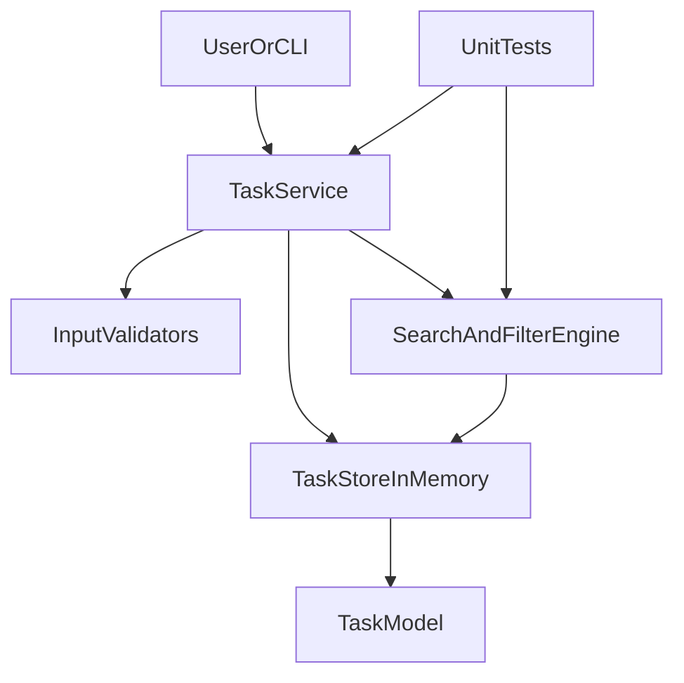

# ARCHITECTURE.md

## System Overview
Personal Task Tracker is implemented as a modular Python application with clear separation:
domain model, service logic, and tests.

## Mermaid Diagram

## Module Responsibilities
- **TaskModel**: defines task structure (`id`, `title`, `description`, `due_date`, `priority`, `labels`, `status`).
- **InputValidators**: validates due date, priority values, and update payloads.
- **TaskStoreInMemory**: persistent state during runtime using in-memory dictionary/list.
- **TaskService**: public operations (CRUD, mark complete, query by filters).
- **SearchAndFilterEngine**: applies query, label, status, and priority filters deterministically.
- **UnitTests**: verifies normal and edge-case behavior.

## Data Flow
1. Client requests operation (create/update/list/search).
2. Service validates input.
3. Store is updated or queried.
4. Optional filter engine narrows results.
5. Response returned as serializable dictionary/list objects.

## Non-Functional Notes
- Deterministic sorting by due date then id for stable outputs.
- Errors are explicit and actionable (`ValueError`, `KeyError`).
- No dynamic code execution and no untrusted input evaluation.
