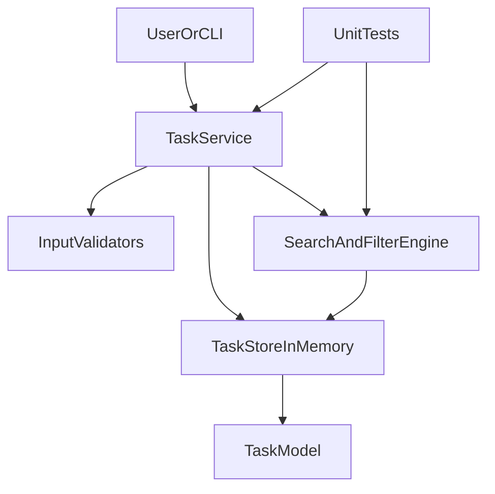

# ARCHITECTURE.md

## Системийн тойм
Personal Task Tracker нь Python дээр хэрэгжсэн жижиг modular application.
Архитектур нь domain model, service logic, validation, search/filter logic, test гэсэн хэсгүүдийг
ойлгомжтой ялгаж өгсөн.

## Mermaid diagram

## Module-уудын үүрэг
- **TaskModel**: task-ийн бүтэц тодорхойлно (`id`, `title`, `description`, `due_date`, `priority`, `labels`, `status`).
- **InputValidators**: due date, priority, update payload зэрэг input-ыг шалгана.
- **TaskStoreInMemory**: runtime үед task-уудыг in-memory dictionary/list хэлбэрээр хадгална.
- **TaskService**: public operation-уудыг гүйцэтгэнэ (CRUD, complete хийх, filter/search).
- **SearchAndFilterEngine**: query, label, status, priority filter-үүдийг deterministic байдлаар хэрэглэнэ.
- **UnitTests**: normal болон edge-case behavior-ийг баталгаажуулна.

## Data flow
1. Client create/update/list/search operation дуудна.
2. Service орж ирсэн input-ыг validate хийнэ.
3. Store шинэчлэгдэнэ эсвэл query хийнэ.
4. Filter engine шаардлагатай бол үр дүнг нарийсгана.
5. Serializable dictionary/list object хэлбэрээр response буцаана.

## Non-functional тэмдэглэл
- Stable output гаргахын тулд due date дараа нь id-аар deterministic sort хийнэ.
- Алдаа тодорхой, засахад ойлгомжтой байна (`ValueError`, `KeyError`).
- Dynamic code execution болон untrusted input evaluation ашиглахгүй.
